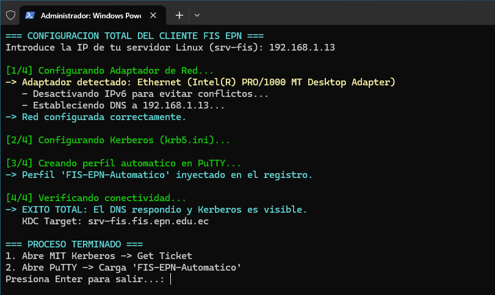
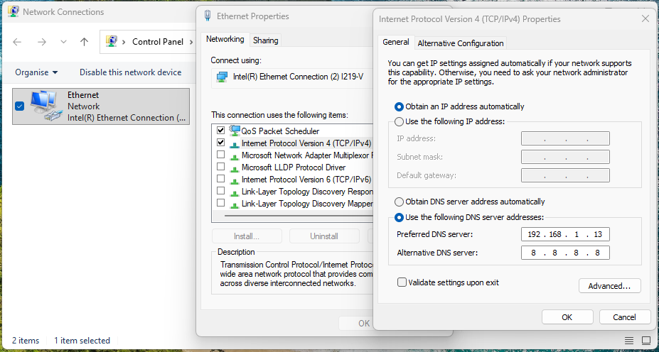
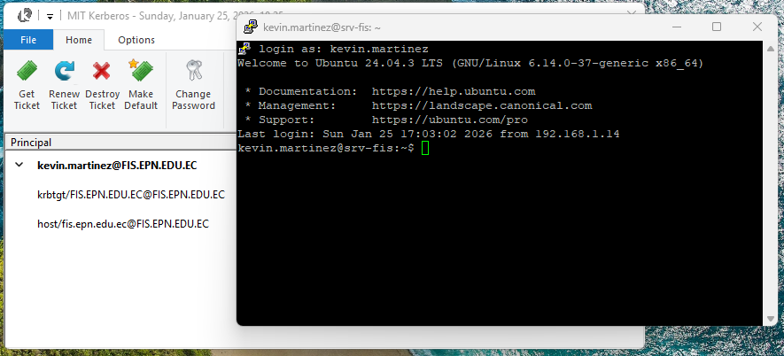

# Configuration Guide: Windows Client (Kerberos + SSH)

This guide details the steps to configure a Windows 10/11 workstation to authenticate against the `FIS.EPN.EDU.EC` Kerberos server and access via SSH without a password (Single Sign-On).

## Prerequisites

Before configuring the network or scripts, it is **mandatory** to install the following software:

1.  **MIT Kerberos for Windows (64-bit)**
    * Official Download: [MIT Kerberos Dist](https://web.mit.edu/kerberos/dist/index.html)
    * *Note:* Restart your computer after installation to ensure environment variables are loaded correctly.
2.  **PuTTY (SSH Client)**
    * Download: [PuTTY.org](https://www.chiark.greenend.org.uk/~sgtatham/putty/latest.html)

---

## Option A: Automatic Configuration (Recommended)

A PowerShell script was prepared that performs all network, security, and registration configurations automatically.

**Script Location:** `../client_config_scripts/windows_client.ps1`

### Steps:

1.  Open the folder where you downloaded the repository.
2.  Right-click on an empty space in the folder and open PowerShell **as Administrator**.
3.  Run the following command to allow the script execution (Temporary Security Bypass):

```powershell
powershell -ExecutionPolicy Bypass -File ..\client_config_scripts\windows_client.ps1
```

4. Follow the on-screen instructions:
* Enter the **Linux Server IP** when prompted.
* The script will configure DNS, disable IPv6, and create the PuTTY profile automatically.



---

## Option B: Manual Configuration

If you prefer to configure the client step-by-step, follow these instructions.

### 1. Network Configuration (DNS)

Kerberos requires the client to be able to resolve the domain's SRV records.

* Go to **Control Panel > Network and Sharing Center > Change adapter settings**.
* Right-click on your adapter (Wi-Fi or Ethernet) > **Properties**.
* **Uncheck** the box "Internet Protocol Version 6 (TCP/IPv6)".
* In "Internet Protocol Version 4 (TCP/IPv4)", set the **Preferred DNS** to your Linux Server IP (e.g., `192.168.1.x`).



### 2. Kerberos Configuration File (krb5.ini)

You must create the configuration file so Windows knows where to find the KDC.

* File Path: `C:\ProgramData\MIT\Kerberos5\krb5.ini`
* *Note:* The `ProgramData` folder is usually hidden.
* File Content:

```ini
[libdefaults]
    default_realm = FIS.EPN.EDU.EC
    dns_lookup_realm = true
    dns_lookup_kdc = true
    forwardable = true

[realms]
    FIS.EPN.EDU.EC = {}

[domain_realm]
    .fis.epn.edu.ec = FIS.EPN.EDU.EC
    fis.epn.edu.ec = FIS.EPN.EDU.EC

```

### 3. PuTTY Configuration

To achieve SSO, PuTTY must be configured to use GSSAPI.

1. Open PuTTY.
2. Go to **Connection > SSH > Auth > GSSAPI**.
3. Check the boxes:
* [x] Attempt GSSAPI authentication
* [x] Allow GSSAPI credential delegation

4. Go to **Session**, set the Hostname to `fis.epn.edu.ec` and save the session.

---

## Verification and Usage

> **Note:** To perform these tests, you must use a valid user account. 

> You can use the default user **`kevin.martinez`** with the password **`Kevin123.`** (created during server setup), or create a new one by running the `gestion_fis.sh` script on the server.

1. Open **MIT Kerberos Ticket Manager**.
2. Click on **Get Ticket**.
3. Enter your username (e.g., `kevin.martinez`) and password.
4. You should see a valid active ticket.
5. Open **PuTTY**, load the saved session, and click Open. You should log in without being asked for a password.


