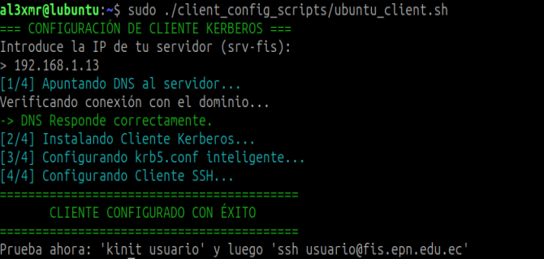
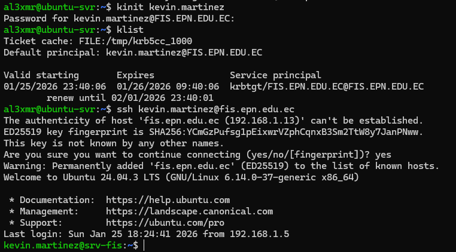

# Guía de Configuración: Cliente Linux (Ubuntu/Debian)

Esta guía explica cómo configurar una máquina Linux secundaria para que actúe como cliente del dominio `FIS.EPN.EDU.EC`, permitiendo autenticación centralizada y SSO.

## Requisitos Previos

* Acceso **Root** o `sudo` en la máquina cliente.
* Conectividad de red con el servidor principal (Ping debe funcionar).

---

## Opción A: Configuración Automática (Script)

El repositorio incluye un script Bash que instala paquetes, configura DNS y ajusta Kerberos automáticamente.

**Ubicación del script:** `../client_config_scripts/ubuntu_client.sh`

### Pasos:

1.  Navega a la carpeta de scripts en el cliente:
    ```bash
    cd linux-kerberos-ldap-integration/client_config_scripts
    ```

2.  Dale permisos de ejecución al script:
    ```bash
    chmod +x ubuntu_client.sh
    ```

3.  Ejecuta el script como superusuario:
    ```bash
    sudo ./ubuntu_client.sh
    ```

4.  Ingresa la **IP del Servidor KDC** cuando el script lo solicite.



---

## Opción B: Configuración Manual

### 1. Configuración de DNS
El cliente debe usar el servidor KDC como su servidor de nombres para encontrar los registros SRV.

* Edita `/etc/resolv.conf`:
    ```bash
    nameserver [IP_DEL_SERVIDOR]
    nameserver 8.8.8.8
    search fis.epn.edu.ec
    ```

### 2. Instalación de Paquetes
Instala las utilidades de usuario de Kerberos:

```bash
sudo apt update
sudo apt install krb5-user
```

* Si solicita el "Default Realm", escribe: `FIS.EPN.EDU.EC` (en mayúsculas).

### 3. Configuración de Kerberos

Edita el archivo `/etc/krb5.conf` para habilitar la búsqueda por DNS:

```ini
[libdefaults]
    default_realm = FIS.EPN.EDU.EC
    dns_lookup_realm = true
    dns_lookup_kdc = true
    ticket_lifetime = 24h
    forwardable = true

[realms]
    FIS.EPN.EDU.EC = {}

[domain_realm]
    .fis.epn.edu.ec = FIS.EPN.EDU.EC
    fis.epn.edu.ec = FIS.EPN.EDU.EC
```

### 4. Configuración SSH (Cliente)

Para no tener que escribir flags adicionales al conectar, configura el cliente SSH globalmente en `/etc/ssh/ssh_config`:

```bash
# Agregar al final del archivo
GSSAPIAuthentication yes
GSSAPIDelegateCredentials yes
```

---

## Verificación y Uso
>**Nota:** Para realizar estas pruebas, debe usar una cuenta de usuario válida. 

> Puede usar el usuario predeterminado **`kevin.martinez`** con la contraseña **`Kevin123.`** (creada durante la configuración del servidor) o crear una nueva ejecutando el script `gestion_fis.sh` en el servidor.


1. Obtén un ticket (Login):
```bash
kinit usuario.prueba
```


2. Verifica el ticket:
```bash
klist
```

*(Debe mostrar `krbtgt/FIS.EPN.EDU.EC`)*

3. Conecta por SSH al servidor:

```bash
ssh usuario.prueba@fis.epn.edu.ec
```

*El acceso debe ser inmediato y sin contraseña.*


